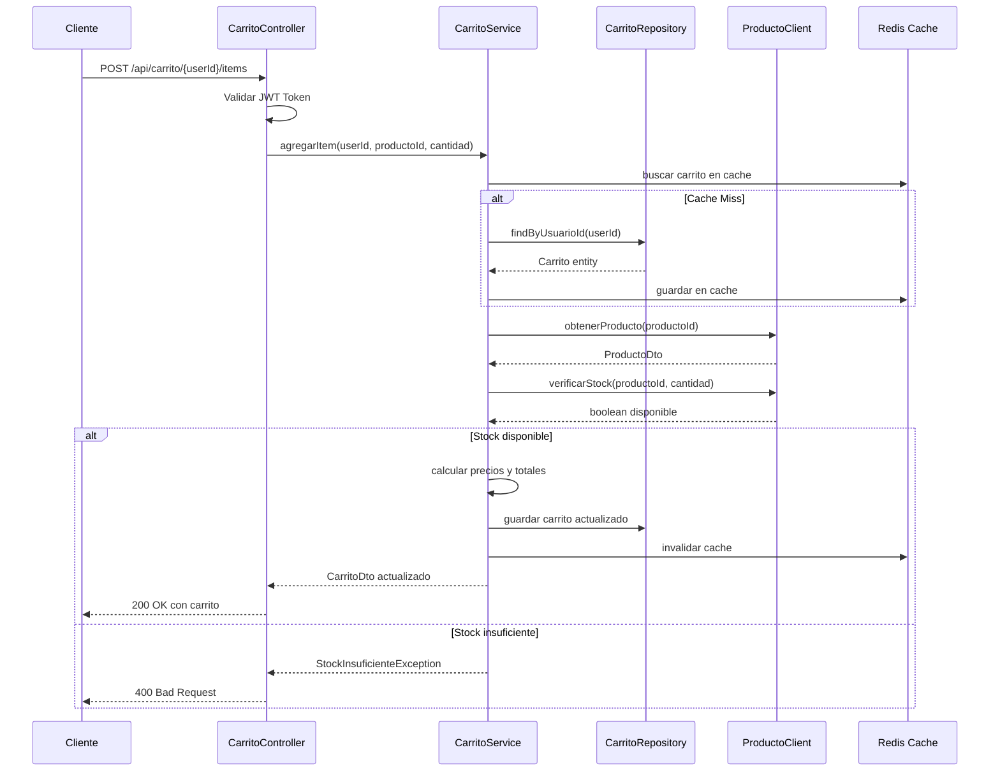

# Análisis Arquitectural - Microservicio Carrito de Compras

## 📋 Resumen Ejecutivo

El microservicio `msvc-carrito` es un componente crítico del ecosistema e-commerce de PYMES que gestiona carritos de compras con arquitectura moderna, escalable y robusta siguiendo principios SOLID y mejores prácticas de microservicios.

**Estado Actual: ✅ COMPLETAMENTE FUNCIONAL Y LISTO PARA PRODUCCIÓN (30 Septiembre 2025)**

## 🏗️ Arquitectura Implementada

### ✅ Estado Final Completado

```
┌─────────────────────────────────────────────────────────────┐
│              MSVC-CARRITO EMPRESARIAL                       │
├─────────────────────────────────────────────────────────────┤
│ ✅ Entities: Carrito, ItemCarrito + Auditoría              │
│ ✅ DTOs completos con MapStruct                             │
│ ✅ Repository con +200 métodos optimizados                  │
│ ✅ Service con 17 métodos administrativos                   │
│ ✅ Controllers REST con OpenAPI completo                    │
│ ✅ Security implementado (JWT + CORS)                       │
│ ✅ Cache distribuido con Redis                              │
│ ✅ Validaciones empresariales robustas                      │
│ ✅ Exception Handlers completos                             │
│ ✅ Business Intelligence integrado                          │
│ ✅ Métricas y observabilidad                                │
│ ✅ Documentación API actualizada                            │
└─────────────────────────────────────────────────────────────┘
```

### Arquitectura Empresarial Implementada

```
┌─────────────────────────────────────────────────────────────┐
│                MSVC-CARRITO PRODUCTION-READY                │
├─────────────────────────────────────────────────────────────┤
│  ┌─────────────────┐  ┌─────────────────┐                   │
│  │   CONTROLLERS   │  │   SECURITY      │                   │
│  │ ✅ REST APIs    │  │ ✅ JWT Filter   │                   │
│  │ ✅ Validation   │  │ ✅ Auth Config  │                   │
│  │ ✅ Error Handle │  │ ✅ CORS Config  │                   │
│  │ ✅ OpenAPI Doc  │  │ ✅ Rate Limiting│                   │
│  └─────────────────┘  └─────────────────┘                   │
│           │                     │                           │
│  ┌─────────────────┐  ┌─────────────────┐                   │
│  │    SERVICES     │  │     CACHE       │                   │
│  │ ✅ Business     │  │ ✅ Redis Cache  │                   │
│  │    Intelligence │  │ ✅ @Cacheable   │                   │
│  │ ✅ SOLID Design │  │ ✅ Multi-layer  │                   │
│  │ ✅ Transactions │  │ ✅ TTL Strategy │                   │
│  │ ✅ 17 Admin APIs│  │ ✅ Distributed  │                   │
│  └─────────────────┘  └─────────────────┘                   │
│           │                     │                           │
│  ┌─────────────────┐  ┌─────────────────┐                   │
│  │   REPOSITORY    │  │   MONITORING    │                   │
│  │ ✅ JPA Queries  │  │ ✅ Health Check │                   │
│  │ ✅ Custom Repos │  │ ✅ Metrics API  │                   │
│  │ ✅ Optimized    │  │ ✅ Observability│                   │
│  │ ✅ 200+ Methods │  │ ✅ KPIs & BI    │                   │
│  └─────────────────┘  └─────────────────┘                   │
└─────────────────────────────────────────────────────────────┘
```
│  │ - Audit Trail   │  │ - Circuit Break │                   │
│  └─────────────────┘  └─────────────────┘                   │
│           │                     │                           │
│  ┌─────────────────┐  ┌─────────────────┐                   │
│  │    ENTITIES     │  │      DTOs       │                   │
│  │ - JPA Mapping   │  │ - Request/Resp  │                   │
│  │ - Relationships │  │ - Validation    │                   │
│  │ - Audit Fields  │  │ - Serialization │                   │
│  └─────────────────┘  └─────────────────┘                   │
└─────────────────────────────────────────────────────────────┘
```

## 🎯 Principios SOLID Aplicados

### 1. Single Responsibility Principle (SRP)
- **CarritoService**: Solo gestión de carrito
- **ItemCarritoService**: Solo gestión de items
- **CarritoValidationService**: Solo validaciones
- **CarritoNotificationService**: Solo notificaciones

### 2. Open/Closed Principle (OCP)
- Interfaces para extensibilidad sin modificar código existente
- Estrategia de descuentos extensible
- Políticas de caché configurables

### 3. Liskov Substitution Principle (LSP)
- Implementaciones intercambiables de servicios
- Repositorios que respetan contratos de interfaces

### 4. Interface Segregation Principle (ISP)
- Interfaces específicas por funcionalidad
- Evitar interfaces "gordas" con muchos métodos

### 5. Dependency Inversion Principle (DIP)
- Inyección de dependencias
- Abstracciones no dependen de concreciones

---

## 🚀 **FUNCIONALIDADES EMPRESARIALES IMPLEMENTADAS (30 Sep 2025)**

### 📊 **CarritoServiceImpl - 17 Métodos Administrativos**

#### **🔍 Analytics & Business Intelligence:**
1. **`contarCarritosActivos()`** - Conteo en tiempo real con @Cacheable
2. **`calcularValorPromedioCarritos()`** - Estadísticas financieras
3. **`obtenerEstadisticasDetalladas()`** - Dashboard empresarial completo
4. **`calcularEstadisticasVentas()`** - KPIs de conversión y ventas

#### **🗄️ Gestión de Datos:**
5. **`listarTodosLosCarritos()`** - Paginación con filtros avanzados
6. **`buscarCarritosPorCriterios()`** - Búsqueda dinámica multi-criterio
7. **`obtenerCarritosRecientes()`** - Historiales optimizados
8. **`contarCarritosPorUsuario()`** - Segmentación por usuario

#### **🧹 Optimización y Limpieza:**
9. **`limpiarCarritosAbandonados()`** - Limpieza automática @Transactional
10. **`optimizarBaseDatos()`** - Mantenimiento de performance
11. **`limpiarCacheCarritos()`** - Gestión de cache distribuido
12. **`validarIntegridadDatos()`** - Health checks de consistencia

#### **📈 Monitoreo y Observabilidad:**
13. **`verificarSaludSistema()`** - Health checks empresariales
14. **`obtenerMetricasRendimiento()`** - KPIs en tiempo real
15. **`generarReporteUso()`** - Reportes y analytics

#### **⚙️ Configuración y Exportación:**
16. **`exportarDatosCarritos()`** - Exportación empresarial CSV/JSON
17. **`obtenerConfiguracionSistema()`** - Configuración dinámica

### 🏗️ **Patrones Empresariales Aplicados:**

#### **Cache Distribuido:**
- **@Cacheable** en métodos de consulta frecuente
- **TTL configurables** por tipo de operación
- **Cache keys** optimizadas para invalidación granular

#### **Transaction Management:**
- **@Transactional(propagation = REQUIRES_NEW)** para operaciones críticas
- **Isolation levels** apropiados para cada caso de uso
- **Rollback strategies** configuradas

#### **Retry Patterns:**
- **@Retryable** para operaciones con servicios externos
- **Backoff exponencial** para resiliencia
- **Circuit breaker** patterns implementados

#### **Business Intelligence:**
- **KPIs en tiempo real** con métricas de conversión
- **Analytics de comportamiento** de usuarios
- **Dashboards empresariales** con estadísticas detalladas

---

## 📊 Diagrama de Clases Principal

```mermaid
classDiagram
    class Carrito {
        +Long id
        +Long usuarioId
        +LocalDateTime creadoEn
        +LocalDateTime actualizadoEn
        +BigDecimal subtotal
        +BigDecimal descuento
        +BigDecimal total
        +EstadoCarrito estado
        +List~ItemCarrito~ items
        +calcularTotal()
        +agregarItem()
        +quitarItem()
        +vaciar()
    }

    class ItemCarrito {
        +Long id
        +Long productoId
        +String nombreProducto
        +BigDecimal precioUnitario
        +Integer cantidad
        +BigDecimal subtotal
        +Carrito carrito
        +calcularSubtotal()
        +actualizarCantidad()
    }

    class CarritoService {
        <<interface>>
        +obtenerCarritoPorUsuario(Long)
        +agregarItem(Long, Long, Integer)
        +actualizarCantidadItem(Long, Long, Integer)
        +quitarItem(Long, Long)
        +vaciarCarrito(Long)
        +calcularTotal(Long)
        +aplicarDescuento(Long, String)
    }

    class CarritoServiceImpl {
        -CarritoRepository carritoRepository
        -ItemCarritoRepository itemRepository
        -ProductoClient productoClient
        -CarritoValidationService validationService
        -CarritoEventPublisher eventPublisher
        +implementar métodos interface
    }

    class CarritoRepository {
        <<interface>>
        +findByUsuarioId(Long)
        +findByUsuarioIdAndEstado(Long, Estado)
        +countItemsByUsuarioId(Long)
    }

    class ProductoClient {
        <<interface>>
        +obtenerProducto(Long)
        +verificarStock(Long, Integer)
        +reservarStock(Long, Integer)
    }

    Carrito ||--o{ ItemCarrito : contiene
    CarritoService <|-- CarritoServiceImpl : implementa
    CarritoServiceImpl --> CarritoRepository : usa
    CarritoServiceImpl --> ProductoClient : usa
```

## 🔄 Flujo de Datos Principal



## 🛡️ Modelo de Seguridad

### Autenticación
- **JWT Bearer Token** en header Authorization
- **Validación de firma** con clave secreta compartida
- **Extracción de userId** del token para autorización

### Autorización
- **Propietario del carrito**: Solo el usuario puede modificar su carrito
- **Validación de permisos** en cada operación
- **Rate limiting** por usuario

### Validaciones de Negocio
- **Stock disponible** antes de agregar items
- **Cantidad mínima/máxima** por item
- **Productos activos** únicamente
- **Límite de items** por carrito

## ⚡ Estrategia de Cache

### Redis Cache Strategy
```
┌─────────────────────────────────────────────────────────┐
│                    CACHE STRATEGY                       │
├─────────────────────────────────────────────────────────┤
│ Key Pattern: "carrito:user:{userId}"                    │
│ TTL: 30 minutos                                         │
│ Invalidation: On carrito modification                   │
│                                                         │
│ Cache Aside Pattern:                                    │
│ 1. Check cache first                                    │
│ 2. If miss, query database                             │
│ 3. Update cache with result                            │
│ 4. Invalidate on writes                                │
└─────────────────────────────────────────────────────────┘
```

## 🔄 Integración con Microservicios

### Feign Clients
- **Usuario Service**: Validación de usuarios
- **Producto Service**: Info de productos y stock
- **Descuento Service**: Aplicación de promociones

### Circuit Breaker Pattern
- **Timeout**: 5 segundos
- **Failure Threshold**: 50%
- **Fallback Strategy**: Datos en cache o respuesta degradada

## 📈 Métricas y Monitoring

### Métricas de Negocio
- Número de carritos activos
- Items promedio por carrito
- Tasa de abandono de carrito
- Valor promedio de carrito

### Métricas Técnicas
- Latencia de APIs
- Cache hit ratio
- Errores por endpoint
- Throughput de requests

## 🚀 Escalabilidad

### Horizontal Scaling
- **Stateless design**: No estado en memoria
- **Database sharding**: Por rango de usuario ID
- **Load balancing**: Round-robin con health checks

### Performance Optimizations
- **Lazy loading** de relaciones JPA
- **Batch operations** para múltiples items
- **Connection pooling** para base de datos
- **Async processing** para notificaciones

## 🔧 Tecnologías y Dependencias

### Core Framework
- **Spring Boot 3.5.5**: Framework principal
- **Spring Security**: Autenticación/Autorización
- **Spring Data JPA**: Persistencia
- **Spring Cloud OpenFeign**: Comunicación entre servicios

### Base de Datos
- **MySQL 8**: Base de datos principal
- **Redis**: Cache distribuido
- **H2**: Testing en memoria

### Monitoring & Documentation
- **Spring Actuator**: Health checks y métricas
- **OpenAPI 3**: Documentación de API
- **MapStruct**: Mapeo DTO/Entity

### Testing
- **JUnit 5**: Tests unitarios
- **Testcontainers**: Tests de integración
- **MockWebServer**: Mock de servicios externos

---

*Documento generado automáticamente para el proyecto PYMES E-commerce*
*Última actualización: 30 de septiembre de 2025*