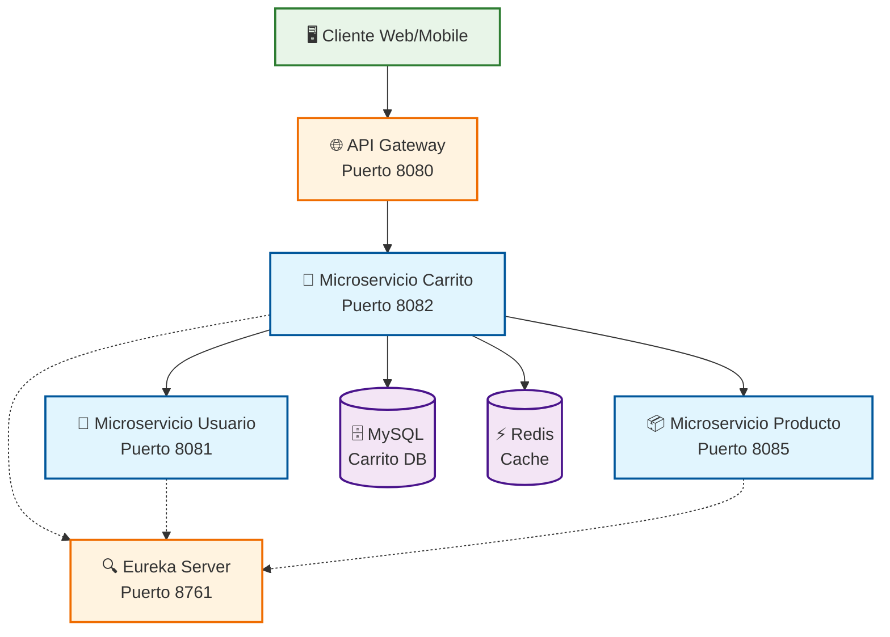
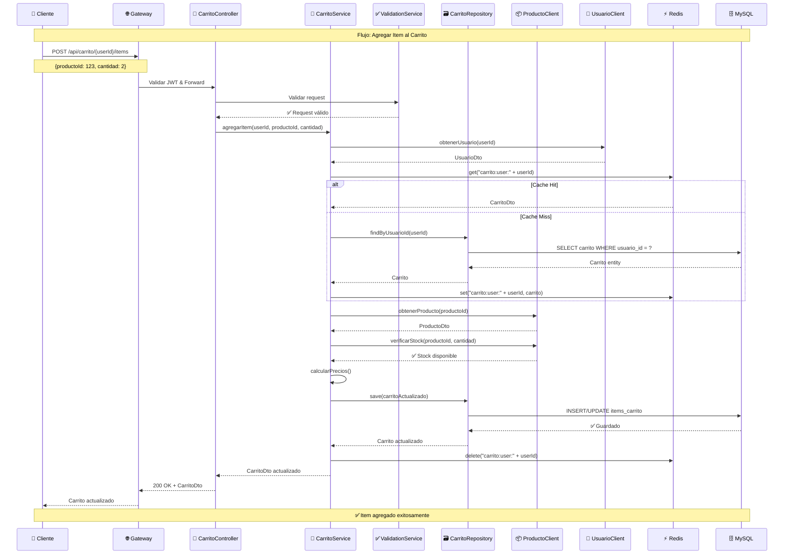
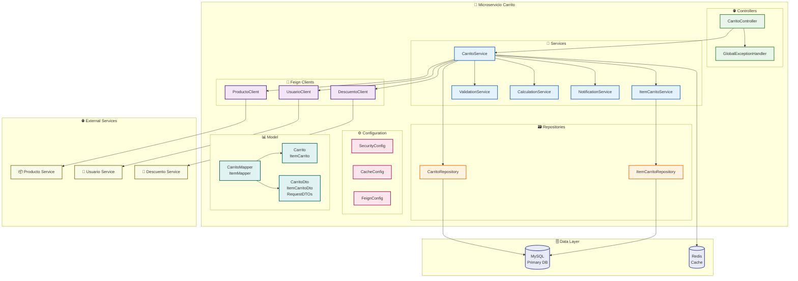
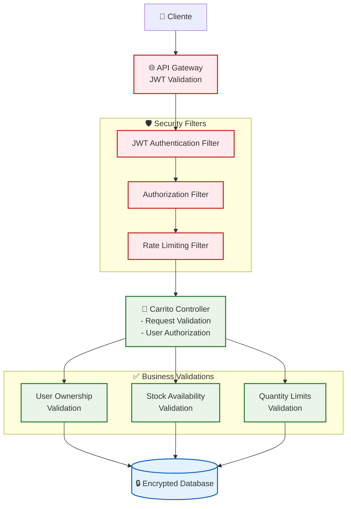
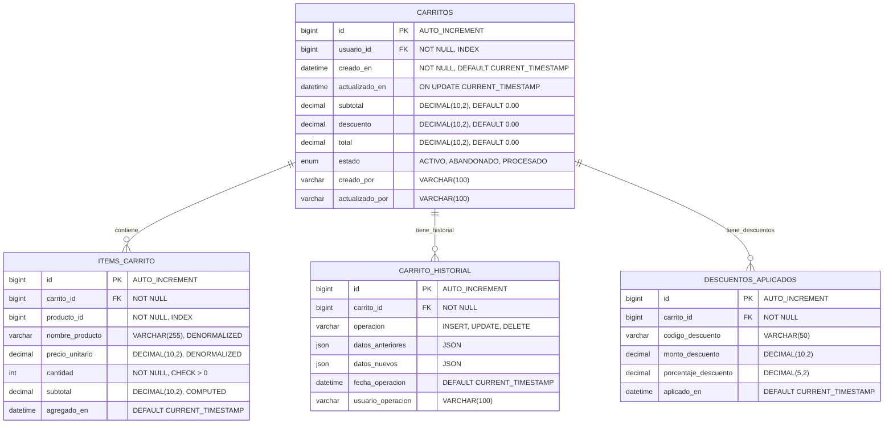
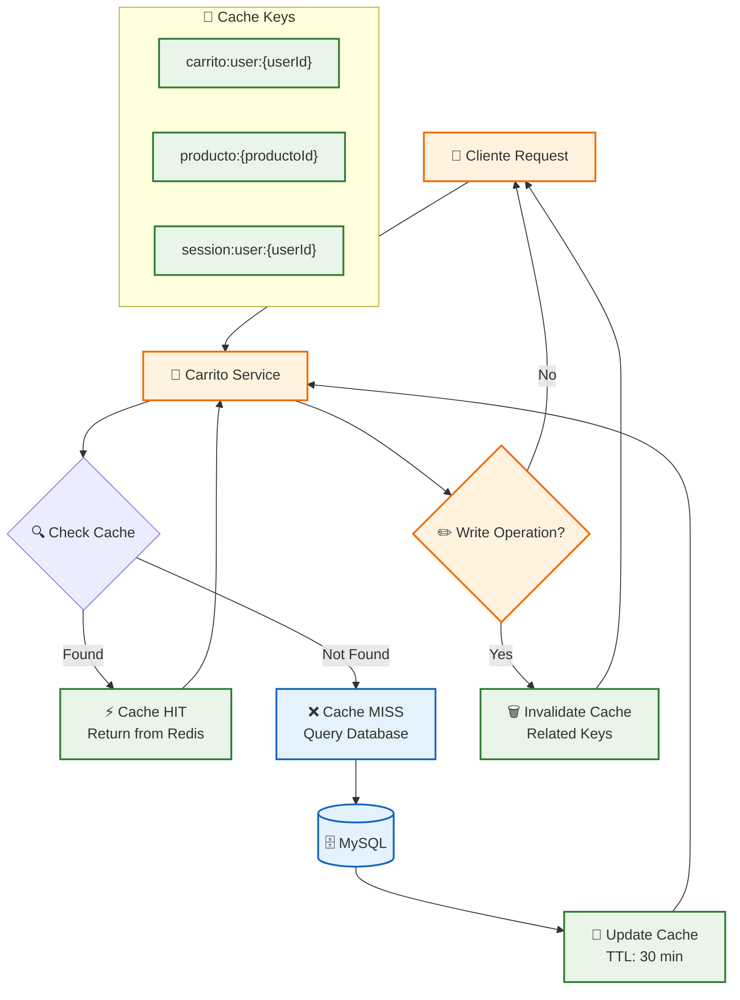
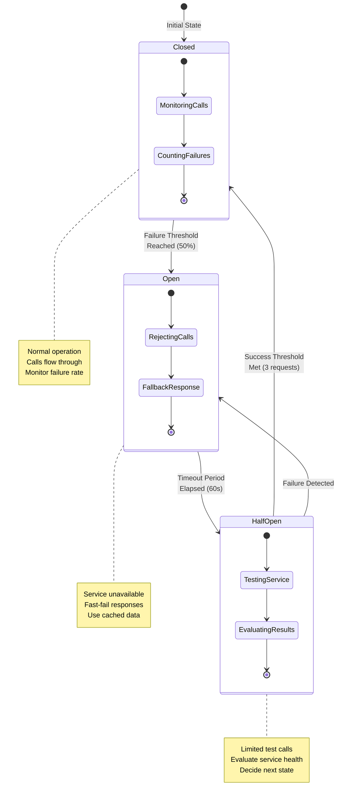
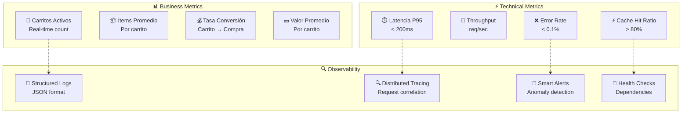

# 🏗️ Diagramas de Arquitectura - Microservicio Carrito de Compras

## 📊 Diagrama de Arquitectura General



## 🎯 Diagrama de Capas del Microservicio

```mermaid
graph TD
    %% Capa de Presentación
    Controller[🌐 Controller Layer<br/>- CarritoController<br/>- Validation<br/>- Security]
    
    %% Capa de Servicio
    Service[🔧 Service Layer<br/>- CarritoService<br/>- ItemCarritoService<br/>- ValidationService<br/>- CalculationService]
    
    %% Capa de Repositorio
    Repository[🗃️ Repository Layer<br/>- CarritoRepository<br/>- ItemCarritoRepository<br/>- Custom Queries]
    
    %% Capa de Integración
    Integration[🔗 Integration Layer<br/>- ProductoClient<br/>- UsuarioClient<br/>- DescuentoClient]
    
    %% Capa de Datos
    Database[(🗄️ MySQL Database<br/>- carritos<br/>- items_carrito)]
    CacheLayer[(⚡ Redis Cache<br/>- carrito:user:{id}<br/>- producto:{id})]
    
    %% Configuración y Seguridad
    Config[⚙️ Configuration<br/>- SecurityConfig<br/>- CacheConfig<br/>- FeignConfig]
    
    %% Flujo de capas
    Controller --> Service
    Service --> Repository
    Service --> Integration
    Repository --> Database
    Service --> CacheLayer
    Config -.-> Controller
    Config -.-> Service
    Config -.-> Repository
    
    %% Estilos
    classDef layer fill:#e3f2fd,stroke:#1565c0,stroke-width:2px
    classDef data fill:#f1f8e9,stroke:#33691e,stroke-width:2px
    classDef config fill:#fce4ec,stroke:#ad1457,stroke-width:2px
    
    class Controller,Service,Repository,Integration layer
    class Database,CacheLayer data
    class Config config
```

## 🔄 Diagrama de Flujo - Agregar Item al Carrito



## 🏢 Diagrama de Componentes Detallado



## 🔐 Diagrama de Seguridad



## 📊 Diagrama de Base de Datos



## ⚡ Diagrama de Cache Strategy



## 🔄 Diagrama de Circuit Breaker



---

## 📈 Métricas y Monitoring

### 🎯 Dashboard de Métricas



---

*Diagramas generados para el microservicio de carrito de compras*  
*Proyecto: PYMES E-commerce*  
*Última actualización: 30 de septiembre de 2025*