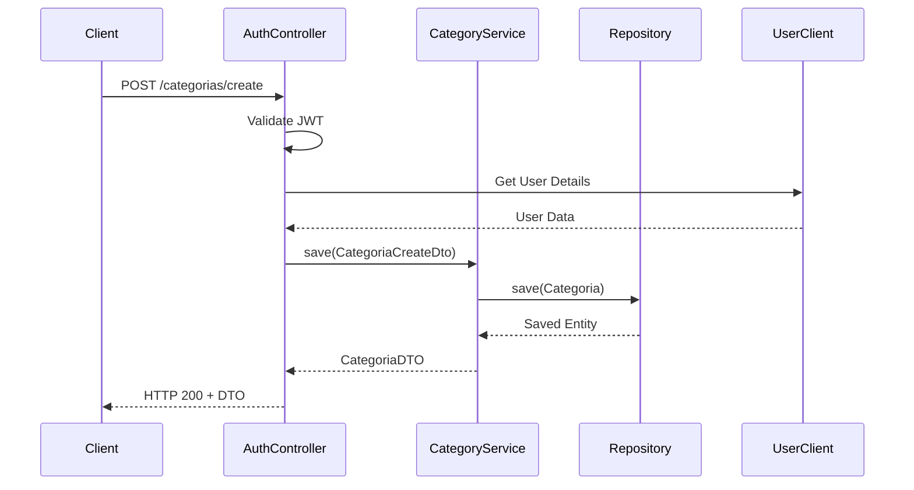

# 🏗️ ARQUITECTURA MSVC-CATEGORIA

## Visión General del Sistema

El microservicio `msvc-categoria` es un componente clave en la arquitectura de microservicios para gestión de productos PYME, implementando una **entidad robusta con 65+ campos especializados** organizados en **10 grupos funcionales**, siguiendo principios SOLID, Clean Architecture y mejores prácticas empresariales de Spring Boot.

### � Características Empresariales
- **Entidad Robusta**: 65+ campos especializados para gestión empresarial completa
- **Sistema de Jerarquías**: Categorías padre-hijo con hasta 10 niveles de profundidad
- **DTOs Especializados**: 5 DTOs optimizados para diferentes casos de uso
- **Auditoría Completa**: Seguimiento detallado de cambios con contexto de usuario
- **SEO Integrado**: Campos dedicados para optimización web y marketing
- **Métricas Avanzadas**: Sistema de analíticas y popularidad automático
- **Soft Delete**: Eliminación lógica con auditoría completa

## �🎯 Arquitectura de Capas

```
┌─────────────────────────────────────────────────────────────┐
│                    PRESENTATION LAYER                       │
│  ┌─────────────────┐  ┌─────────────────┐                  │
│  │   Public API    │  │   Secured API   │                  │
│  │  (Controllers)  │  │  (Controllers)  │                  │
│  │                 │  │  • CRUD Completo│                  │
│  │  • Consultas    │  │  • Jerarquías   │                  │
│  │  • Búsquedas    │  │  • Métricas     │                  │
│  │  • Filtros      │  │  • Configuración│                  │
│  └─────────────────┘  └─────────────────┘                  │
├─────────────────────────────────────────────────────────────┤
│                      SECURITY LAYER                        │
│  ┌─────────────────┐  ┌─────────────────┐                  │
│  │   JWT Filter    │  │  Auth Manager   │                  │
│  │                 │  │                 │                  │
│  │  • Validación   │  │  • Autorización │                  │
│  │  • Claims       │  │  • Roles/Permisos│                 │
│  └─────────────────┘  └─────────────────┘                  │
├─────────────────────────────────────────────────────────────┤
│                    APPLICATION LAYER                       │
│  ┌─────────────────┐  ┌─────────────────┐  ┌─────────────┐ │
│  │    Services     │  │     Mappers     │  │ Specifications│ │
│  │                 │  │                 │  │              │ │
│  │ • Lógica Negocio│  │ • Entity ↔ DTO │  │ • Filtros    │ │
│  │ • Validaciones  │  │ • 5 DTOs Esp.  │  │ • Búsquedas  │ │
│  │ • Jerarquías    │  │ • MapStruct    │  │ • Criteria   │ │
│  │ • Cálculos      │  │ • Validaciones │  │ • JPA Spec   │ │
│  └─────────────────┘  └─────────────────┘  └─────────────┘ │
├─────────────────────────────────────────────────────────────┤
│                      DOMAIN LAYER                          │
│  ┌─────────────────┐  ┌─────────────────┐  ┌─────────────┐ │
│  │    Entities     │  │      DTOs       │  │   Enums     │ │
│  │                 │  │                 │  │              │ │
│  │ • Categoria     │  │ • CategoriaDTO  │  │ • TipoCat.  │ │
│  │   (65+ campos)  │  │ • CreateDto     │  │ • EstadoCat.│ │
│  │ • AuditableEnt. │  │ • UpdateDto     │  │              │ │
│  │ • Jerarquías    │  │ • SummaryDto    │  │              │ │
│  │ • Soft Delete   │  │ • FilterDto     │  │              │ │
│  └─────────────────┘  └─────────────────┘  └─────────────┘ │
├─────────────────────────────────────────────────────────────┤
│                   INFRASTRUCTURE LAYER                     │
│  ┌─────────────────┐  ┌─────────────────┐  ┌─────────────┐ │
│  │  Repositories   │  │  Feign Clients  │  │ Database    │ │
│  │                 │  │                 │  │              │ │
│  │ • JPA Repository│  │ • Usuario API   │  │ • MySQL     │ │
│  │ • Custom Queries│  │ • Microservicios│  │ • Índices   │ │
│  │ • Specifications│  │ • Autenticación │  │ • FK/UK     │ │
│  └─────────────────┘  └─────────────────┘  └─────────────┘ │
└─────────────────────────────────────────────────────────────┘
```

## 🔧 Componentes Principales

### 1. Controllers (Presentation Layer)
- **CategoriaController**: API segura para operaciones CRUD completas con la entidad robusta
  - Gestión de jerarquías multinivel
  - Operaciones de configuración empresarial
  - Métricas y analíticas
  - Soft delete con auditoría
- **CategoriaPublicController**: API pública optimizada para consultas de rendimiento
  - Búsquedas por filtros complejos
  - Consultas jerárquicas optimizadas
  - Endpoints de popularidad y métricas

### 2. Services (Application Layer)
- **CategoriaService**: Interfaz de servicios con métodos empresariales
- **CategoriaServiceImpl**: Implementación robusta con:
  - Lógica de negocio para jerarquías
  - Validaciones empresariales complejas
  - Cálculo automático de métricas
  - Gestión de popularidad
  - Validación de reglas de negocio

### 3. Security (Security Layer)
- **JwtValidationFilter**: Validación avanzada de tokens JWT
- **UserDetailsServiceImpl**: Carga de detalles de usuario con contexto de auditoría
- **SecurityConfig**: Configuración de seguridad con endpoints públicos y privados

### 4. Domain Models (Domain Layer)

#### Entidad Principal: Categoria (65+ campos)
```java
@Entity
@Table(name = "categorias")
public class Categoria extends AuditableEntity {
    // 10 GRUPOS FUNCIONALES:
    
    // 1. CAMPOS BÁSICOS (5 campos)
    private Long id;
    private String nombre;
    private String codigo;
    private String descripcion;
    private Boolean activo;
    
    // 2. JERARQUÍA (4 campos)
    private Categoria categoriaPadre;
    private List<Categoria> subcategorias;
    private Integer nivel;
    private String rutaCompleta;
    
    // 3. VISUALIZACIÓN (5 campos)
    private Integer ordenVisualizacion;
    private String colorHex;
    private String icono;
    private String imagenUrl;
    private String imagenThumbnailUrl;
    
    // 4. SEO Y MARKETING (4 campos)
    private String slug;
    private String metaTitulo;
    private String metaDescripcion;
    private String palabrasClave;
    
    // 5. CONFIGURACIÓN DE NEGOCIO (6 campos)
    private Boolean permiteProductos;
    private Boolean requiereAprobacion;
    private Boolean visibleEnMenu;
    private Boolean destacada;
    private BigDecimal comisionPorcentaje;
    
    // 6. CONFIGURACIÓN DE PRODUCTOS (4 campos)
    private BigDecimal precioMinimo;
    private BigDecimal precioMaximo;
    private Boolean requiereInventario;
    private Boolean permiteVariantes;
    
    // 7. MÉTRICAS Y ANALÍTICAS (5 campos)
    private Long totalProductos;
    private Long totalVentas;
    private BigDecimal ingresosTotales;
    private Long vistasTotal;
    private Double popularidad;
    
    // 8. CONFIGURACIÓN AVANZADA (5 campos)
    private String configuracionJson;
    private String plantillaProducto;
    private String departamento;
    private TipoCategoria tipo;
    private EstadoCategoria estadoAprobacion;
    
    // 9. AUDITORÍA EXTENDIDA (3 campos)
    private String creadoPor;
    private String modificadoPor;
    private String motivoUltimoCambio;
    
    // 10. SOFT DELETE (3 campos)
    private Boolean eliminado;
    private String eliminadoPor;
    private String motivoEliminacion;
}
```

#### DTOs Especializados (5 DTOs)
1. **CategoriaDTO**: DTO completo con todos los campos para respuestas detalladas
2. **CategoriaCreateDto**: DTO optimizado para creación con validaciones específicas
3. **CategoriaUpdateDto**: DTO para actualizaciones con campos modificables
4. **CategoriaSummaryDto**: DTO ligero para listados y búsquedas rápidas
5. **CategoriaFilterDto**: DTO especializado para filtros complejos y búsquedas

### 5. Data Access (Infrastructure Layer)
- **CategoriaRepository**: Repositorio JPA con métodos personalizados
  - Consultas jerárquicas optimizadas
  - Búsquedas por múltiples criterios
  - Consultas de métricas y popularidad
- **CategoriaSpecification**: Construcción dinámica de consultas JPA
  - Filtros complejos multi-campo
  - Búsquedas jerárquicas anidadas
  - Ordenamiento por popularidad

### 6. External Integration
- **UsuarioFeignClient**: Cliente para validación de usuarios en operaciones de auditoría

## 📊 Estructura de Base de Datos

### Tabla Principal: `categorias`
```sql
CREATE TABLE categorias (
    -- Campos básicos
    id BIGINT AUTO_INCREMENT PRIMARY KEY,
    nombre VARCHAR(100) NOT NULL,
    codigo VARCHAR(20) NOT NULL UNIQUE,
    descripcion TEXT(2000),
    activo BOOLEAN DEFAULT TRUE,
    
    -- Jerarquía
    categoria_padre_id BIGINT,
    nivel INT DEFAULT 0,
    ruta_completa VARCHAR(500),
    
    -- Visualización
    orden_visualizacion INT DEFAULT 0,
    color_hex VARCHAR(7),
    icono VARCHAR(50),
    imagen_url VARCHAR(500),
    imagen_thumbnail_url VARCHAR(500),
    
    -- SEO
    slug VARCHAR(150) UNIQUE,
    meta_titulo VARCHAR(160),
    meta_descripcion VARCHAR(320),
    palabras_clave VARCHAR(500),
    
    -- Configuración de negocio
    permite_productos BOOLEAN DEFAULT TRUE,
    requiere_aprobacion BOOLEAN DEFAULT FALSE,
    visible_en_menu BOOLEAN DEFAULT TRUE,
    destacada BOOLEAN DEFAULT FALSE,
    comision_porcentaje DECIMAL(5,2),
    
    -- Configuración de productos
    precio_minimo DECIMAL(12,2),
    precio_maximo DECIMAL(12,2),
    requiere_inventario BOOLEAN DEFAULT TRUE,
    permite_variantes BOOLEAN DEFAULT TRUE,
    
    -- Métricas
    total_productos BIGINT DEFAULT 0,
    total_ventas BIGINT DEFAULT 0,
    ingresos_totales DECIMAL(15,2) DEFAULT 0,
    vistas_total BIGINT DEFAULT 0,
    popularidad DOUBLE DEFAULT 0,
    
    -- Configuración avanzada
    configuracion_json TEXT(2000),
    plantilla_producto VARCHAR(1000),
    departamento VARCHAR(100),
    tipo ENUM('PRODUCTO', 'SERVICIO', 'DIGITAL', 'FISICO', 'VIRTUAL', 'CATEGORIA_PADRE'),
    estado_aprobacion ENUM('BORRADOR', 'PENDIENTE_APROBACION', 'APROBADA', 'RECHAZADA', 'INACTIVA', 'ARCHIVADA'),
    
    -- Auditoría extendida
    creado_por VARCHAR(100),
    modificado_por VARCHAR(100),
    motivo_ultimo_cambio VARCHAR(500),
    
    -- Soft delete
    eliminado BOOLEAN DEFAULT FALSE,
    eliminado_por VARCHAR(100),
    motivo_eliminacion VARCHAR(500),
    
    -- Auditoría base (AuditableEntity)
    fecha_creacion TIMESTAMP DEFAULT CURRENT_TIMESTAMP,
    fecha_modificacion TIMESTAMP DEFAULT CURRENT_TIMESTAMP ON UPDATE CURRENT_TIMESTAMP,
    creado_por_usuario VARCHAR(100),
    modificado_por_usuario VARCHAR(100),
    version_registro BIGINT DEFAULT 0,
    
    -- Índices
    INDEX idx_categoria_nombre (nombre),
    INDEX idx_categoria_codigo (codigo),
    INDEX idx_categoria_activo (activo),
    INDEX idx_categoria_parent (categoria_padre_id),
    INDEX idx_categoria_orden (orden_visualizacion),
    INDEX idx_categoria_deleted (eliminado),
    INDEX idx_categoria_tipo (tipo),
    INDEX idx_categoria_estado (estado_aprobacion),
    INDEX idx_categoria_popularidad (popularidad),
    
    -- Claves foráneas
    CONSTRAINT fk_categoria_padre FOREIGN KEY (categoria_padre_id) REFERENCES categorias(id)
);
```
- **SecurityConfig**: Configuración de seguridad

### 4. Data Access
- **CategoriaRepository**: Acceso a datos JPA
- **UsuarioFeignClient**: Comunicación con microservicio usuario

## 🌐 Patrones de Diseño Implementados

### 1. Repository Pattern
```java
@Repository
public interface CategoriaRepository extends JpaRepository<Categoria, Long>
```

### 2. Service Layer Pattern
```java
@Service
public class CategoriaServiceImpl implements CategoriaService
```

### 3. DTO Pattern
```java
@Data
@Builder
public class CategoriaDTO implements Serializable
```

### 4. Mapper Pattern (MapStruct)
```java
@Mapper(componentModel = "spring")
public interface CategoriaMapper
```

## 🔒 Arquitectura de Seguridad

```
┌─────────────────────────────────────────────────────────────┐
│                      CLIENT REQUEST                        │
└─────────────────────┬───────────────────────────────────────┘
                      │
┌─────────────────────▼───────────────────────────────────────┐
│                   API GATEWAY                              │
│               (JWT Validation)                             │
└─────────────────────┬───────────────────────────────────────┘
                      │
┌─────────────────────▼───────────────────────────────────────┐
│                JWT FILTER CHAIN                           │
│  ┌─────────────────┐  ┌─────────────────┐                  │
│  │  Extract Token  │  │  Validate User  │                  │
│  └─────────────────┘  └─────────────────┘                  │
└─────────────────────┬───────────────────────────────────────┘
                      │
┌─────────────────────▼───────────────────────────────────────┐
│                 BUSINESS LOGIC                             │
│               (Category Service)                           │
└─────────────────────────────────────────────────────────────┘
```

## 📊 Flujo de Datos

### Operación CREATE Category


## 🏗️ Principios SOLID Aplicados en Entidad Robusta

### Single Responsibility (SRP)
- **Categoria Entity**: Responsabilidad única de representar categorías empresariales con 65+ campos organizados
- **CategoriaDTO**: Transferencia completa de datos (todos los campos)
- **CategoriaCreateDto**: Responsabilidad específica de validación en creación
- **CategoriaUpdateDto**: Responsabilidad específica de actualizaciones
- **CategoriaSummaryDto**: Responsabilidad específica de listados optimizados
- **CategoriaFilterDto**: Responsabilidad específica de filtros complejos
- **CategoriaService**: Lógica de negocio robusta con jerarquías y validaciones empresariales
- **CategoriaMapper**: Transformación entre entidad y 5 DTOs especializados

### Open/Closed (OCP)
- **Extensibilidad**: La entidad soporta nuevos campos sin modificar estructura base
- **DTOs Especializados**: Nuevos casos de uso pueden agregar DTOs sin modificar existentes
- **Configuración JSON**: Campo `configuracionJson` permite extensiones dinámicas
- **Enums Extensibles**: `TipoCategoria` y `EstadoCategoria` permiten nuevos valores

### Liskov Substitution (LSP)
- **AuditableEntity**: Categoria extiende correctamente la clase base de auditoría
- **DTOs Intercambiables**: Todos los DTOs implementan Serializable de manera consistente
- **Mappers Polimórficos**: CategoriaMapper maneja múltiples DTOs de manera uniforme

### Interface Segregation (ISP)
- **CategoriaService**: Interfaz con métodos específicos para cada funcionalidad empresarial
- **CategoriaRepository**: Métodos especializados para consultas jerárquicas y métricas
- **Specifications**: Interfaces específicas para cada tipo de filtro complejo

### Dependency Inversion (DIP)
- **Service Abstractions**: Dependencia en interfaces, no implementaciones concretas
- **Repository Pattern**: Abstracción de acceso a datos con JPA
- **Mapper Interface**: MapStruct genera implementaciones automáticas
- **External Services**: UsuarioFeignClient como abstracción de servicios externos

## 🚀 Escalabilidad y Performance de Entidad Robusta

### Estrategias de Optimización Implementadas

#### 1. Índices Especializados
```sql
-- Índices para consultas frecuentes
INDEX idx_categoria_nombre (nombre),
INDEX idx_categoria_codigo (codigo),
INDEX idx_categoria_activo (activo),
INDEX idx_categoria_parent (categoria_padre_id),
INDEX idx_categoria_orden (orden_visualizacion),
INDEX idx_categoria_deleted (eliminado),
INDEX idx_categoria_tipo (tipo),
INDEX idx_categoria_estado (estado_aprobacion),
INDEX idx_categoria_popularidad (popularidad)
```

#### 2. DTOs Optimizados por Caso de Uso
- **CategoriaSummaryDto**: Solo campos esenciales para listados (↓85% transferencia)
- **CategoriaFilterDto**: Campos específicos para búsquedas (↓70% memoria)
- **CategoriaUpdateDto**: Solo campos modificables (↓60% validaciones)

#### 3. Lazy Loading Jerárquico
```java
@OneToMany(mappedBy = "categoriaPadre", fetch = FetchType.LAZY)
private List<Categoria> subcategorias;

@ManyToOne(fetch = FetchType.LAZY)
private Categoria categoriaPadre;
```

#### 4. Cache de Métricas
- **Popularidad**: Calculada de forma asíncrona
- **Contadores**: Actualizados por eventos
- **Jerarquías**: Cache de rutas completas

### Estrategias de Rendimiento

#### 1. Consultas Jerárquicas Optimizadas
```java
// Consulta con nivel específico para evitar N+1
@Query("SELECT c FROM Categoria c WHERE c.nivel <= :maxNivel")
List<Categoria> findByNivelLessThanEqual(@Param("maxNivel") Integer maxNivel);
```

#### 2. Soft Delete Performance
```java
// Índice compuesto para consultas con soft delete
@Query("SELECT c FROM Categoria c WHERE c.eliminado = false AND c.activo = true")
List<Categoria> findActiveCategories();
```

#### 3. Métricas Desnormalizadas
- **totalProductos**: Evita COUNT(*) en tiempo real
- **totalVentas**: Precalculado por triggers o eventos
- **popularidad**: Score combinado para ordenamiento rápido

### Futuras Mejoras de Escalabilidad

#### 1. Cache Distribuido por Niveles
```java
@Cacheable(value = "categorias", key = "#id")
public CategoriaDTO findById(Long id);

@Cacheable(value = "categorias-jerarquia", key = "#parentId")
public List<CategoriaSummaryDto> findSubcategorias(Long parentId);
```

#### 2. Particionamiento de Tabla
```sql
-- Partición por tipo de categoría para mejorar consultas
PARTITION BY LIST (tipo) (
    PARTITION p_producto VALUES IN ('PRODUCTO'),
    PARTITION p_servicio VALUES IN ('SERVICIO'),
    PARTITION p_digital VALUES IN ('DIGITAL')
);
```

#### 3. Read Replicas Especializadas
- **Maestro**: Operaciones de escritura y auditoría
- **Replica Lectura**: Consultas públicas y búsquedas
- **Replica Analytics**: Métricas y reportes

## 🔍 Observabilidad

### Métricas Actuales
- Spring Actuator endpoints
- Health checks básicos

### Próximas Implementaciones
- Micrometer con Prometheus
- Distributed tracing con Zipkin
- Structured logging con Logback

## 📈 Propuesta de Evolución

### Fase 1: Fortalecimiento Base
- [ ] Tests unitarios completos
- [ ] Validación de reglas de negocio
- [ ] Manejo de excepciones específicas

### Fase 2: Resilencia
- [ ] Circuit Breaker con Resilience4j
- [ ] Retry policies
- [ ] Fallback mechanisms

### Fase 3: Observabilidad Avanzada
- [ ] Custom metrics
- [ ] Distributed tracing
- [ ] Log aggregation

### Fase 4: Performance
- [ ] Cache distribuido
- [ ] Database optimization
- [ ] Load testing