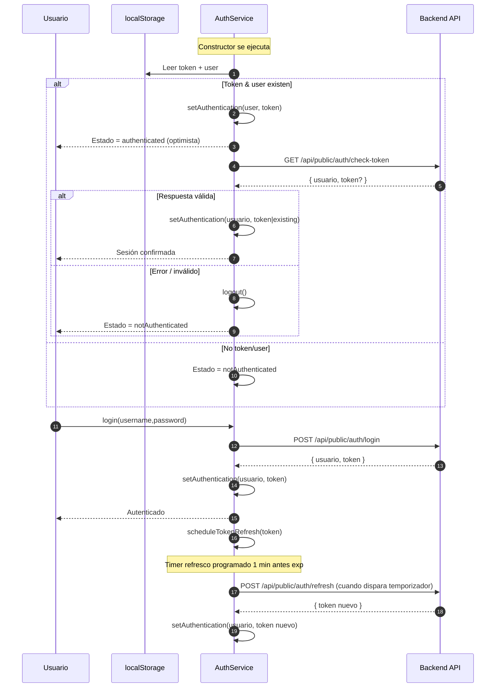
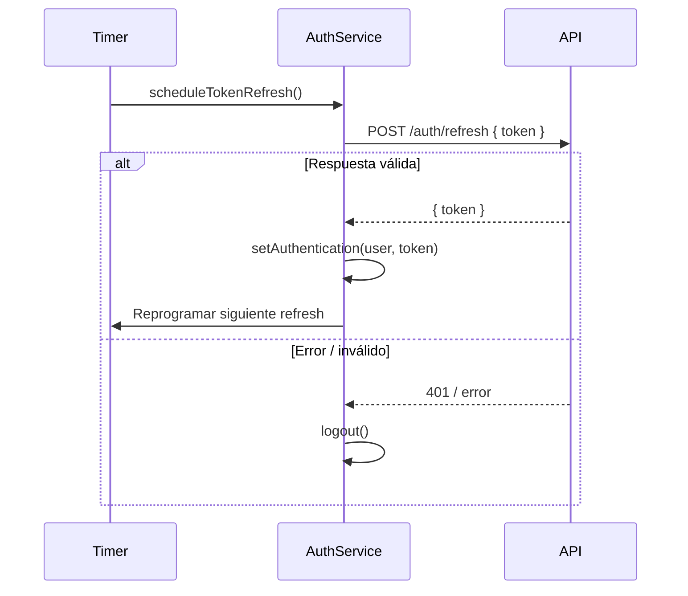

# Flujo Funcional Frontend (Estado Actual Incremental)

> Este documento se diseñó para evolucionar junto con la aplicación. Cada sección usa diagramas Mermaid modulares que podremos ampliar cuando integremos nuevos módulos (producto, catálogo completo, carrito avanzado, checkout, etc.).
>
> Última actualización: 2025-09-29

## Objetivo
Proporcionar una vista clara y navegable del flujo actual de la aplicación (layouts, rutas principales, guards y autenticación) y del ciclo de vida de la sesión (login -> verificación -> roles -> acceso a dashboards). Sirve como apoyo para onboarding, decisiones de refactor y validación de impactos.

## Alcance (Iteración Actual)
Incluye:
- Layouts principales: Main, Auth, Admin.
- Rutas activas públicas y protegidas.
- Guards de acceso (`IsAuthenticatedGuard`, `RoleGuard`).
- Flujo de validación y refresco de token en `AuthService` (simplificado).
- Distribución de dashboards según rol.

No incluye todavía (placeholder para expansión): catálogo completo, detalle producto, carrito flyout, checkout, interceptores HTTP centralizados ni optimizaciones de performance.

## Leyenda
- Rectángulo: Vista / Página / Ruta concreta.
- Parallelogramo (en diagramas de secuencia): Entrada / Respuesta externa.
- Subgrafo: Agrupación lógica (layout o módulo).
- Flecha sólida: Navegación directa o carga lazy.
- Flecha punteada: Acción secundaria / fallback / proceso asíncrono.
- Nota: Elemento aún no implementado o en backlog.

---
## 1. Mapa Estructural (Estado Actual SOLAMENTE)
```mermaid
flowchart TB
    %% Vista estricta de lo que hoy existe funcional en código
    subgraph LAYOUT_MAIN[Layout Main]
      R_ROOT["/ (home)"] --> R_HOME["/home"]
      R_ROOT --> R_ABOUT["/about"]
      R_ROOT --> R_SEARCH["/buscar"\n(lazy SearchModule)]
    end

    subgraph LAYOUT_AUTH[Layout Auth]
      R_AUTH["/auth"\n(redirect a /auth/login)] --> R_LOGIN["/auth/login"\n(en AuthModule lazy)]
    end

    subgraph LAYOUT_ADMIN[Layout Admin]
      R_DASH_ADMIN["/admin/dashboard-admin"\nROLE_ADMIN]
      R_DASH_CLIENT["/admin/dashboard-cliente"\nROLE_CLIENT]
    end

    %% Usuario origen
    U[Usuario] -->|Navega| R_ROOT
    U -->|Login| R_LOGIN
    R_LOGIN -->|Autenticación OK| R_DASH_ADMIN
    R_LOGIN -->|Autenticación OK (cliente)| R_DASH_CLIENT

    classDef guard fill=#fdf6b2,stroke=#c2a500,color=#5c4d00,font-size:11px;
```

### Diferencias vs Futuro
El diagrama anterior NO incluye elementos en backlog ni placeholders. Solo lo que está en `app-routing.module.ts` y se resuelve hoy.

Backlog (no dibujado):
- `/auth/register`
- `/auth/forgot-password`
- Redirect directo `/admin` (pendiente agregar)
- Rutas de catálogo detallado, producto, carrito, checkout
- Página `unauthorized` (referida por guard pero no incluida aún como ruta explícita si no existe el componente)

---
## 2. Flujo de Autenticación y Restauración de Sesión


---
## 3. Guards de Acceso (Resumen Lógico)
```mermaid
flowchart LR
    subgraph Guards
      G1[IsAuthenticatedGuard]\n"authService.isAuthenticated() ?" -->|true| P1[Permite ruta]
      G1 -->|false| R1[Redirect /auth/login]

      G2[RoleGuard]\n"authStatus$ == authenticated" -->|no| R1
      G2 -->|sí| G2B{"hasRole(expectedRoles)?"}
      G2B -->|sí| P1
      G2B -->|no| R2[Redirect /unauthorized]
    end
```

---
## 4. Ciclo de Vida del Refresh Token (Simplificado Frontend)
> El frontend actualmente sólo gestiona refresh vía `refreshToken()` invocado por temporizador. No hay (todavía) interceptor global para reintentar peticiones 401 automáticamente.



---
## 5. Roadmap de Expansión del Diagrama
| Módulo | Estado | Próxima Inserción en Diagramas | Notas |
|--------|--------|--------------------------------|-------|
| Redirect /admin | Pendiente | Sección 1 (Mapa Rutas) | Añadir nodo /admin -> dashboard según rol |
| Interceptor HTTP | Pendiente | Nuevo diagrama secuencia | Manejo 401 + refresh centralizado |
| Catálogo | Backlog | Mapa Rutas + subgrafo catálogo | Grid + ProductTile |
| Producto Detalle | Backlog | Mapa Rutas + secuencia datos | SEO + slug |
| Carrito Flyout | Backlog | Diagrama estado | Store signals + overlay |
| Checkout | Backlog | Flujo multi-paso | Validación progresiva |
| Theming avanzado | Backlog | Diagrama theming tokens | Preferencias persistidas |
| Métricas / Telemetría | Backlog | Flujo eventos | Core instrumentation |

---
## 6. Convenciones para Actualizar
1. Mantener cada agregado en forma incremental (no reescribir histórico sin necesidad).
2. Añadir nueva sección si el flujo no encaja en las existentes.
3. Marcar elementos no implementados con clase `backlog`.
4. Actualizar fecha al inicio del documento cuando se modifique.
5. Sincronizar con `FRONTEND_AUDIT_CHECKLIST.md` (los estados deben coincidir).

---
## 7. Próximos Ajustes Inmediatos Relacionados
- Implementar redirect `/admin` → `/admin/dashboard-admin` (y condicionar a rol si es necesario más adelante).
- Introducir interceptor HTTP para refresh centralizado + handling 401/403.
- Extender diagrama con interceptores una vez añadido.

---
## 8. Anexos / Futuras Integraciones
Reservado para flujos: pago, notificaciones, optimizaciones performance (preload strategy), segmentación roles múltiples.

---
Si algo del diagrama no refleja la realidad del código, priorizar la corrección aquí: la documentación debe converger con la implementación.
