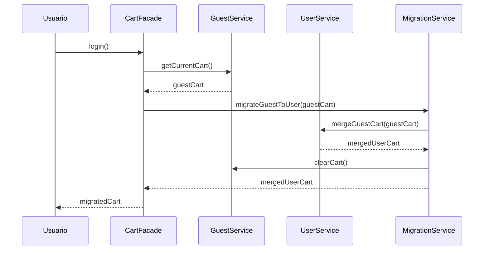
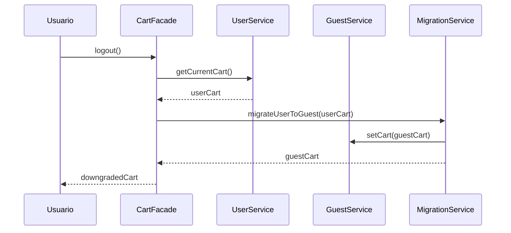
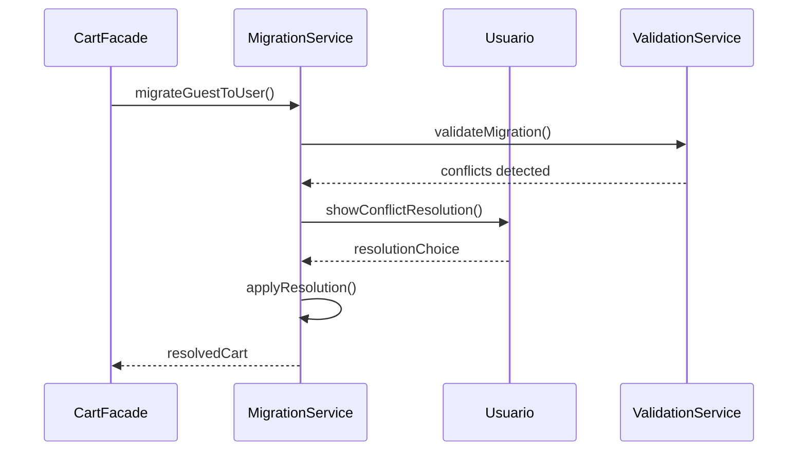

````markdown
# 🔄 Arquitectura Dual: Carrito Público vs Seguro

## 🎯 Conceptos de Arquitectura Dual

### 🌐 **Carrito Público (Guest Cart)**
Carrito para usuarios no autenticados - funcionalidades básicas con persistencia local.

### 🔐 **Carrito Seguro (User Cart)**  
Carrito para usuarios autenticados - funcionalidades completas con persistencia en backend.

---

## 📊 Comparación Funcional

| Funcionalidad | 🌐 Carrito Público | 🔐 Carrito Seguro |
|---------------|-------------------|-------------------|
| **Persistencia** | localStorage | Backend Database |
| **Duración** | Hasta limpiar cache | Indefinida |
| **Sincronización** | Solo local | Tiempo real |
| **Validaciones** | Básicas | Completas |
| **Promociones** | Públicas | Personalizadas |
| **Límites** | Por navegador | Por usuario |
| **Checkout** | Limitado | Completo |
| **Historial** | No | Sí |

---

## 🏗️ Arquitectura de Servicios

### 🌐 **Carrito Público**

#### `CartGuestService`
```typescript
@Injectable({ providedIn: 'root' })
export class CartGuestService implements CartRepository {
  
  private readonly STORAGE_KEY = 'pymes-guest-cart';
  private readonly EXPIRY_DAYS = 7;
  
  // Estado local reactivo
  private cartState$ = new BehaviorSubject<GuestCart>(this.loadFromStorage());
  
  constructor(
    private storage: StorageService,
    private calculator: CartCalculationService,
    private validator: CartGuestValidationService
  ) {}
  
  // Operaciones básicas
  addItem(product: Product, quantity: number): Observable<GuestCart> {
    return this.validator.validateGuestAddition(product, quantity).pipe(
      map(validProduct => this.createCartItem(validProduct, quantity)),
      tap(item => this.addItemToCart(item)),
      map(() => this.getCurrentCart())
    );
  }
  
  updateQuantity(itemId: string, quantity: number): Observable<GuestCart> {
    const cart = this.getCurrentCart();
    const updatedCart = this.calculator.updateItemQuantity(cart, itemId, quantity);
    this.saveToStorage(updatedCart);
    return of(updatedCart);
  }
  
  removeItem(itemId: string): Observable<GuestCart> {
    const cart = this.getCurrentCart();
    const updatedCart = {
      ...cart,
      items: cart.items.filter(item => item.id !== itemId)
    };
    this.saveToStorage(updatedCart);
    return of(updatedCart);
  }
  
  // Persistencia local
  private loadFromStorage(): GuestCart {
    const stored = this.storage.getItem(this.STORAGE_KEY);
    if (stored && this.isNotExpired(stored)) {
      return this.hydrateCart(stored);
    }
    return this.createEmptyCart();
  }
  
  private saveToStorage(cart: GuestCart): void {
    const cartWithExpiry = {
      ...cart,
      expiresAt: this.calculateExpiry()
    };
    this.storage.setItem(this.STORAGE_KEY, cartWithExpiry);
  }
  
  // Migración a carrito de usuario
  migrateToUserCart(): Observable<GuestCart> {
    const guestCart = this.getCurrentCart();
    this.clearGuestCart();
    return of(guestCart);
  }
}
```

#### **Limitaciones del Carrito Público:**
- ❌ Sin validación de stock en tiempo real
- ❌ Solo promociones públicas generales
- ❌ Sin límites por usuario
- ❌ Sin persistencia entre dispositivos
- ❌ Sin historial de cambios
- ❌ Validaciones básicas de productos

---

### 🔐 **Carrito Seguro**

#### `CartUserService`
```typescript
@Injectable({ providedIn: 'root' })
export class CartUserService implements CartRepository {
  
  private readonly baseUrl = `${environment.baseUrl}/api/segura/carrito`;
  
  constructor(
    private http: HttpClient,
    private auth: AuthService,
    private calculator: CartCalculationService,
    private validator: CartUserValidationService,
    private promotions: PromotionService,
    private inventory: InventoryService
  ) {}
  
  // Operaciones avanzadas con backend
  addItem(product: Product, quantity: number): Observable<UserCart> {
    return this.validator.validateUserAddition(product, quantity).pipe(
      mergeMap(() => this.inventory.checkStock(product.id, quantity)),
      mergeMap(stockValidation => {
        if (!stockValidation.available) {
          throw new Error(`Stock insuficiente. Disponible: ${stockValidation.available}`);
        }
        return this.postAddItem(product, quantity);
      }),
      mergeMap(cart => this.promotions.applyEligiblePromotions(cart)),
      tap(cart => this.notifyCartUpdate(cart))
    );
  }
  
  private postAddItem(product: Product, quantity: number): Observable<UserCart> {
    const request = {
      productId: product.id,
      quantity,
      variantId: product.selectedVariant?.id
    };
    
    return this.http.post<ApiResponse<UserCart>>(`${this.baseUrl}/items`, request).pipe(
      map(response => response.data),
      catchError(this.handleError)
    );
  }
  
  // Sincronización en tiempo real
  syncCart(): Observable<UserCart> {
    return this.http.get<ApiResponse<UserCart>>(`${this.baseUrl}`).pipe(
      map(response => response.data),
      tap(cart => this.validateCartIntegrity(cart)),
      catchError(this.handleError)
    );
  }
  
  // Validación avanzada de integridad
  private validateCartIntegrity(cart: UserCart): void {
    cart.items.forEach(item => {
      this.inventory.validateItemIntegrity(item).subscribe(validation => {
        if (!validation.valid) {
          this.handleIntegrityViolation(item, validation);
        }
      });
    });
  }
  
  // Migración desde carrito guest
  mergeGuestCart(guestCart: GuestCart): Observable<UserCart> {
    return this.http.post<ApiResponse<UserCart>>(`${this.baseUrl}/merge`, {
      guestItems: guestCart.items
    }).pipe(
      map(response => response.data),
      tap(cart => this.notifyCartMerged(guestCart, cart))
    );
  }
  
  // APIs del backend
  updateQuantity(itemId: string, quantity: number): Observable<UserCart> {
    return this.http.put<ApiResponse<UserCart>>(`${this.baseUrl}/items/${itemId}`, {
      quantity
    }).pipe(map(response => response.data));
  }
  
  removeItem(itemId: string): Observable<UserCart> {
    return this.http.delete<ApiResponse<UserCart>>(`${this.baseUrl}/items/${itemId}`).pipe(
      map(response => response.data)
    );
  }
  
  applyPromotion(code: string): Observable<UserCart> {
    return this.http.post<ApiResponse<UserCart>>(`${this.baseUrl}/promotions`, {
      promotionCode: code
    }).pipe(map(response => response.data));
  }
  
  removePromotion(promotionId: string): Observable<UserCart> {
    return this.http.delete<ApiResponse<UserCart>>(`${this.baseUrl}/promotions/${promotionId}`).pipe(
      map(response => response.data)
    );
  }
}
```

#### **Ventajas del Carrito Seguro:**
- ✅ Validación de stock en tiempo real
- ✅ Promociones personalizadas
- ✅ Límites y restricciones por usuario
- ✅ Persistencia entre dispositivos
- ✅ Historial completo de cambios
- ✅ Integridad de datos garantizada
- ✅ Análisis de comportamiento

---

## 🎭 Patrón Facade Unificado

### `CartFacadeService`
```typescript
@Injectable({ providedIn: 'root' })
export class CartFacadeService {
  
  private currentCart$: Observable<Cart>;
  
  constructor(
    private auth: AuthService,
    private guestService: CartGuestService,
    private userService: CartUserService,
    private migrationService: CartMigrationService
  ) {
    this.currentCart$ = this.auth.isAuthenticated$.pipe(
      switchMap(isAuth => isAuth ? 
        this.userService.cart$ : 
        this.guestService.cart$
      )
    );
  }
  
  // API unificada independiente del tipo de usuario
  addItem(product: Product, quantity: number): Observable<Cart> {
    return this.auth.isAuthenticated$.pipe(
      take(1),
      switchMap(isAuth => isAuth ?
        this.userService.addItem(product, quantity) :
        this.guestService.addItem(product, quantity)
      )
    );
  }
  
  updateQuantity(itemId: string, quantity: number): Observable<Cart> {
    return this.auth.isAuthenticated$.pipe(
      take(1),
      switchMap(isAuth => isAuth ?
        this.userService.updateQuantity(itemId, quantity) :
        this.guestService.updateQuantity(itemId, quantity)
      )
    );
  }
  
  // Migración automática al autenticarse
  handleAuthenticationChange(isAuthenticated: boolean): Observable<Cart> {
    if (isAuthenticated) {
      return this.migrationService.migrateGuestToUser().pipe(
        catchError(error => {
          console.error('Error migrando carrito:', error);
          return this.userService.syncCart();
        })
      );
    } else {
      return this.guestService.cart$;
    }
  }
  
  // Getters unificados
  get cart$(): Observable<Cart> {
    return this.currentCart$;
  }
  
  get itemCount$(): Observable<number> {
    return this.cart$.pipe(
      map(cart => cart.items.reduce((total, item) => total + item.quantity, 0))
    );
  }
  
  get total$(): Observable<number> {
    return this.cart$.pipe(
      map(cart => cart.total)
    );
  }
}
```

---

## 🔄 Servicio de Migración

### `CartMigrationService`
```typescript
@Injectable({ providedIn: 'root' })
export class CartMigrationService {
  
  constructor(
    private guestService: CartGuestService,
    private userService: CartUserService,
    private validator: CartMigrationValidationService,
    private analytics: AnalyticsService
  ) {}
  
  migrateGuestToUser(): Observable<UserCart> {
    return this.guestService.cart$.pipe(
      take(1),
      filter(guestCart => guestCart.items.length > 0),
      switchMap(guestCart => this.performMigration(guestCart)),
      tap(result => this.analytics.trackCartMigration(result)),
      catchError(error => this.handleMigrationError(error))
    );
  }
  
  private performMigration(guestCart: GuestCart): Observable<UserCart> {
    return this.validator.validateMigration(guestCart).pipe(
      switchMap(validatedCart => this.userService.mergeGuestCart(validatedCart)),
      tap(() => this.guestService.clearCart()),
      catchError(error => this.handleConflicts(guestCart, error))
    );
  }
  
  private handleConflicts(guestCart: GuestCart, error: any): Observable<UserCart> {
    // Estrategias de resolución de conflictos:
    // 1. Mantener cantidades mayores
    // 2. Preservar items únicos del guest
    // 3. Mostrar modal de confirmación al usuario
    
    return this.showConflictResolutionModal(guestCart, error).pipe(
      switchMap(resolution => this.applyResolution(guestCart, resolution))
    );
  }
  
  migrateUserToGuest(): Observable<GuestCart> {
    // Al hacer logout, opcionalmente migrar items recientes a guest
    return this.userService.cart$.pipe(
      take(1),
      map(userCart => this.convertToGuestCart(userCart)),
      tap(guestCart => this.guestService.setCart(guestCart))
    );
  }
}
```

---

## 📋 URLs y Endpoints

### 🌐 **APIs Públicas**
```typescript
// Sin autenticación requerida
GET    /api/public/productos/{id}           # Datos básicos producto
GET    /api/public/promociones/activas     # Promociones públicas
POST   /api/public/carrito/validate        # Validación básica
```

### 🔐 **APIs Seguras**
```typescript
// Requieren autenticación
GET    /api/segura/carrito                 # Obtener carrito usuario
POST   /api/segura/carrito/items           # Agregar item
PUT    /api/segura/carrito/items/{id}      # Actualizar cantidad
DELETE /api/segura/carrito/items/{id}      # Eliminar item
POST   /api/segura/carrito/merge           # Migrar guest cart
POST   /api/segura/carrito/promociones     # Aplicar promoción
DELETE /api/segura/carrito/promociones/{id} # Eliminar promoción
GET    /api/segura/carrito/historial       # Historial cambios
POST   /api/segura/carrito/validate        # Validación completa
```

---

## 🎯 Estrategias de Transición

### **Escenario 1: Usuario se Autentica**


### **Escenario 2: Usuario Cierra Sesión**


### **Escenario 3: Conflictos de Migración**


---

## 📊 Comparación de Performance

| Operación | 🌐 Carrito Público | 🔐 Carrito Seguro |
|-----------|-------------------|-------------------|
| **Agregar Item** | ~50ms (local) | ~200ms (HTTP) |
| **Actualizar Cantidad** | ~20ms (local) | ~150ms (HTTP) |
| **Calcular Total** | ~10ms (local) | ~100ms (server) |
| **Validar Stock** | ❌ Sin validar | ~300ms (real-time) |
| **Aplicar Promoción** | ~30ms (básica) | ~400ms (personalizada) |
| **Persistencia** | ~5ms (localStorage) | ~250ms (database) |

---

**Próximo:** [Integración Backend](./03-INTEGRACION-BACKEND.md)

````
