# 📊 Diagramas: Arquitectura del Carrito de Compras

> **Estado:** 🔄 **PENDIENTE** - Diagramas completos para visualizar arquitectura

## 🏗️ Diagrama de Arquitectura General

### 🧱 **Clean Architecture Overview**
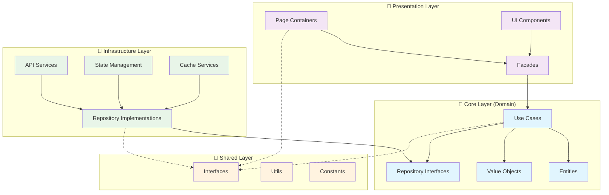

---

## 🔄 Diagramas de Flujo de Datos

### 📈 **Flujo: Agregar Item al Carrito**
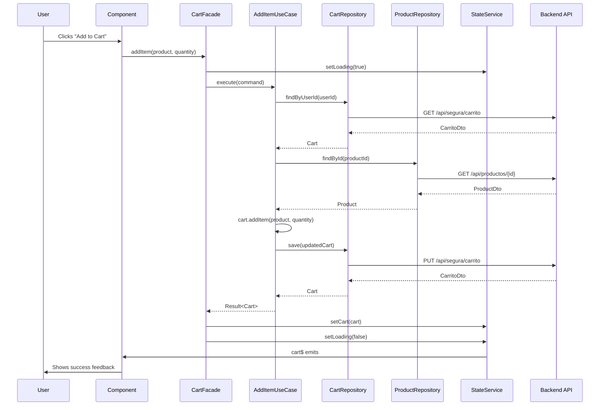

### 🔢 **Flujo: Actualizar Cantidad**
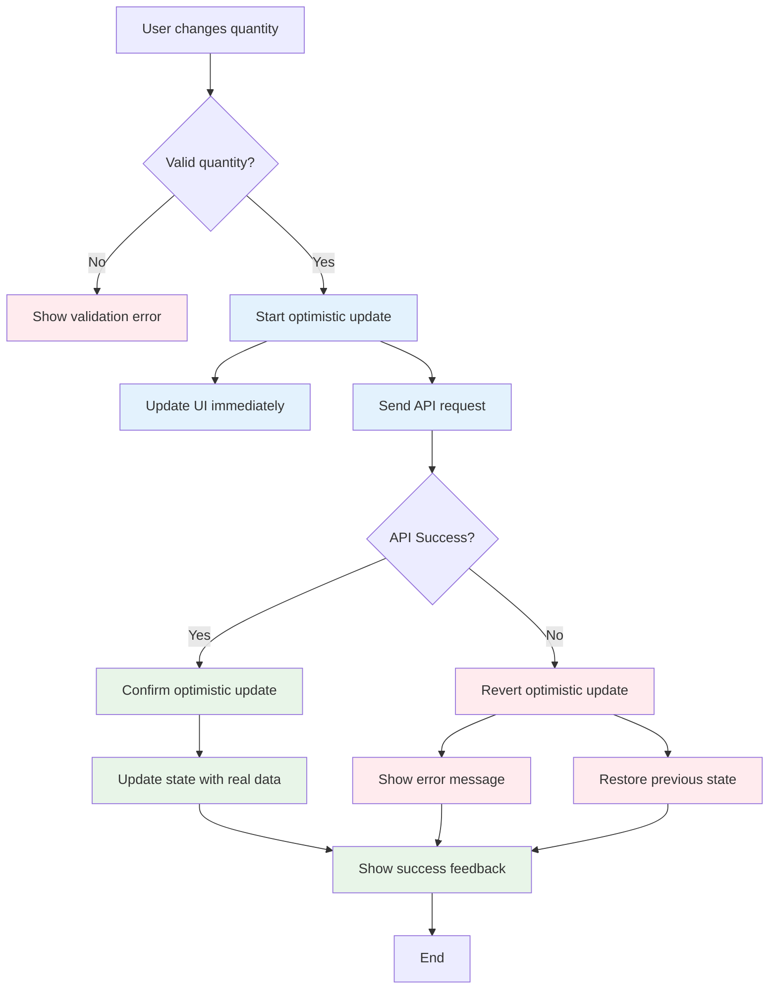

---

## 🏛️ Diagrama de Componentes

### 🧩 **Jerarquía de Componentes**
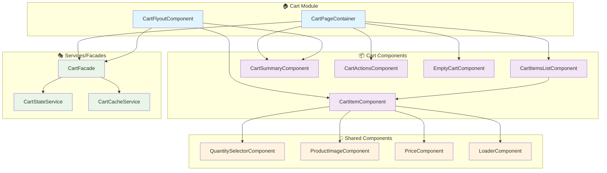

---

## 📊 Diagrama de Estado

### 🔄 **Cart State Machine**
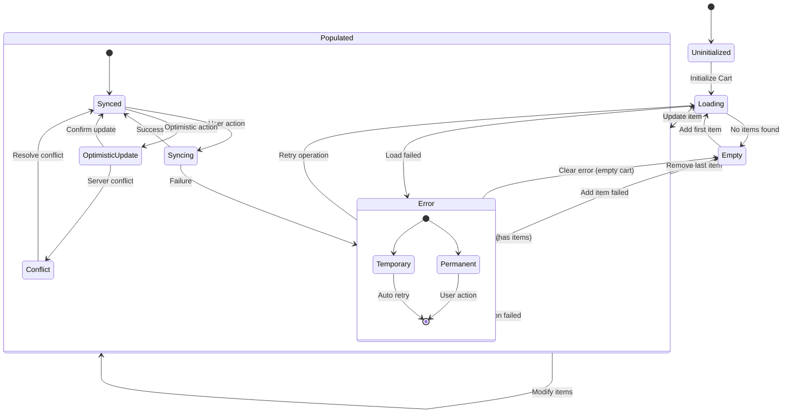

---

## 🗂️ Diagrama de Capas de Datos

### 📚 **Data Layer Architecture**
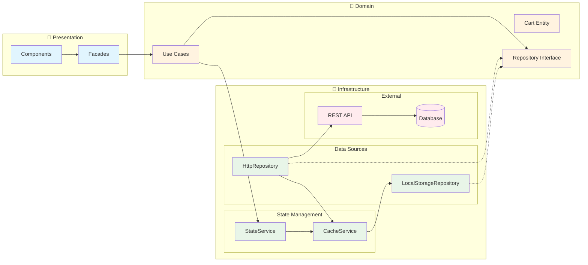

---

## 🚀 Diagrama de Performance

### ⚡ **Optimization Strategy**
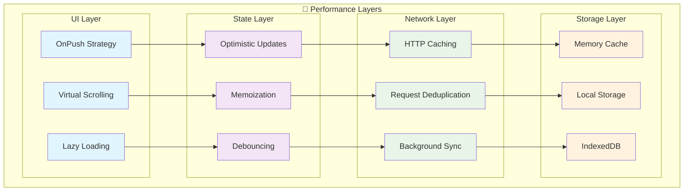

---

## 🔐 Diagrama de Seguridad

### 🛡️ **Security Flow**
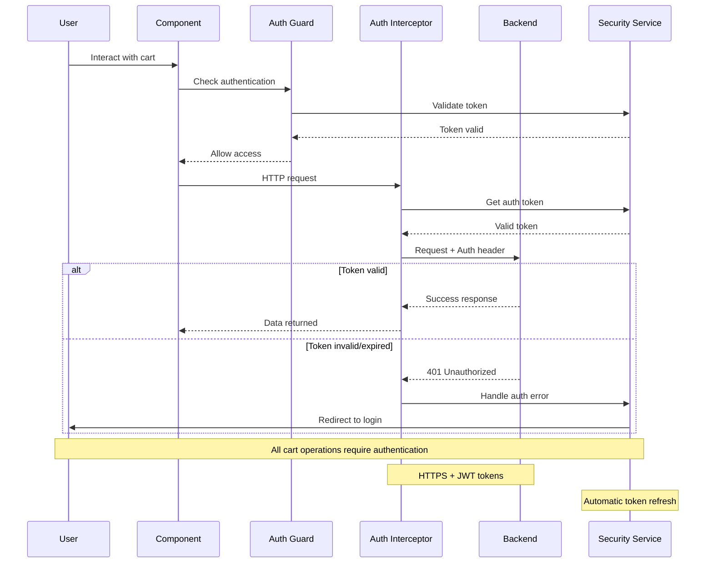

---

## 📱 Diagrama de Responsive Design

### 🖥️ **Breakpoint Strategy**
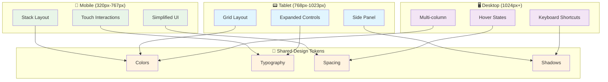

---

## 🧪 Diagrama de Testing

### 🔬 **Testing Pyramid**
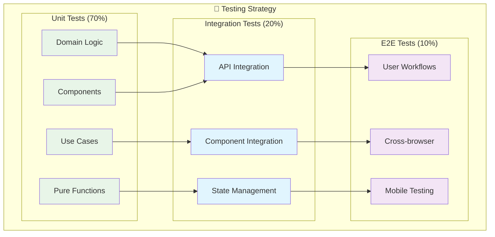

---

## 🔄 Diagrama de CI/CD

### 🚀 **Deployment Pipeline**
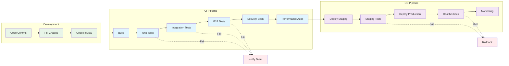

---

## 📈 Diagrama de Monitoreo

### 📊 **Observability Stack**
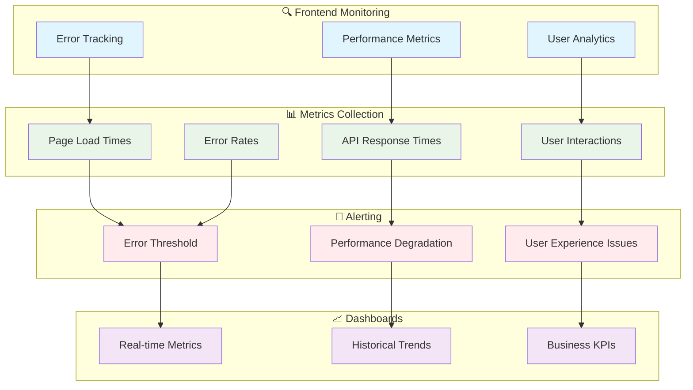

---

**Fin de la documentación del Carrito de Compras**

✅ **Documentación Completada:**
- [x] README.md - Visión general
- [x] 01-ESTRUCTURA-ACTUAL.md - Análisis del estado actual
- [x] 02-ARQUITECTURA-DUAL.md - Clean Architecture propuesta
- [x] 03-INTEGRACION-BACKEND.md - Integración con APIs
- [x] 04-DISEÑO-MODERNO.md - Implementación detallada
- [x] 05-CHECKLIST-IMPLEMENTACION.md - Guía de implementación
- [x] 06-MEJORES-PRACTICAS.md - Estándares y prácticas
- [x] 07-DIAGRAMAS.md - Visualización de arquitectura

🎯 **¿Dónde empezamos?** ¡La documentación está lista para guiar la implementación!
