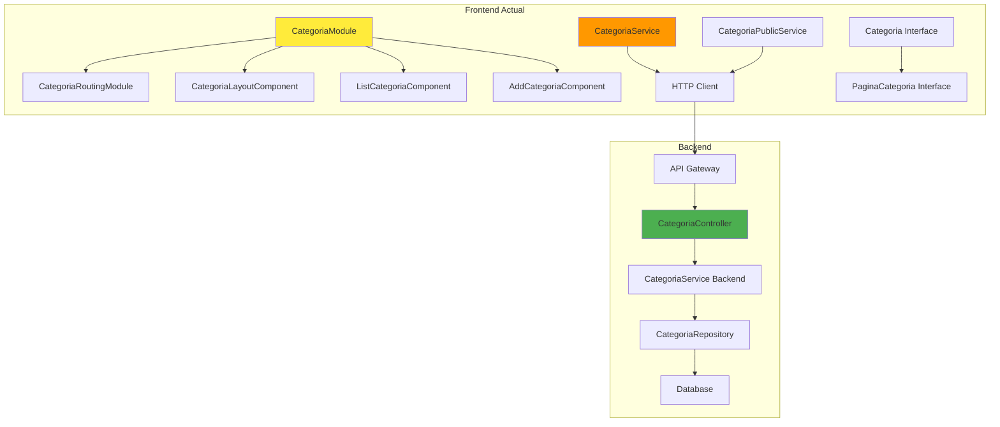
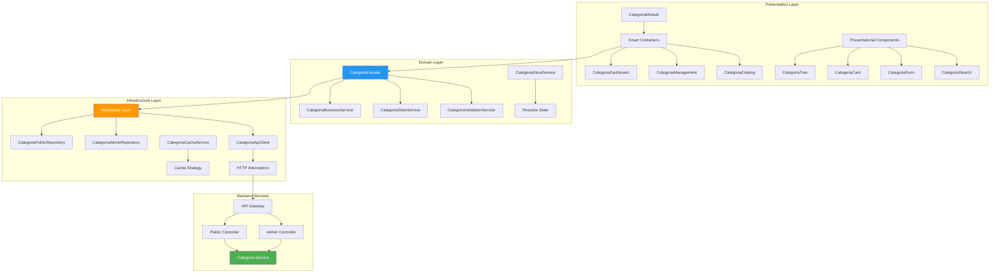
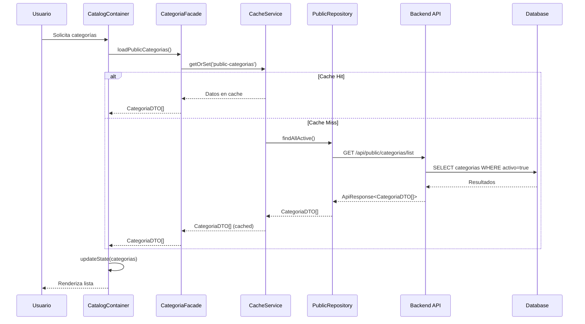
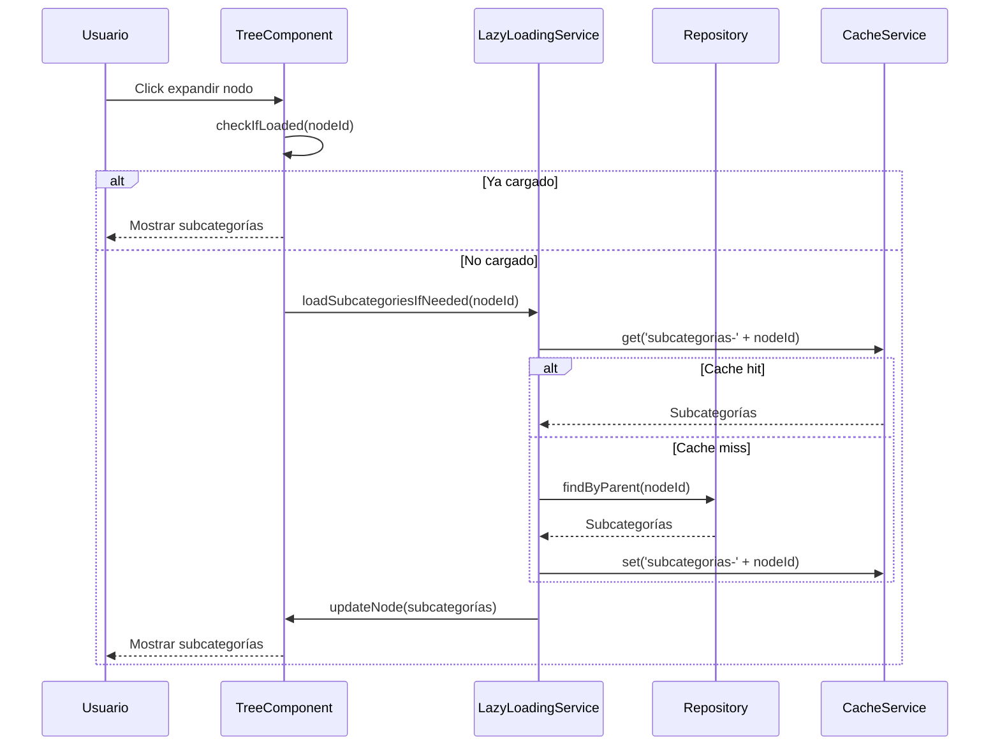
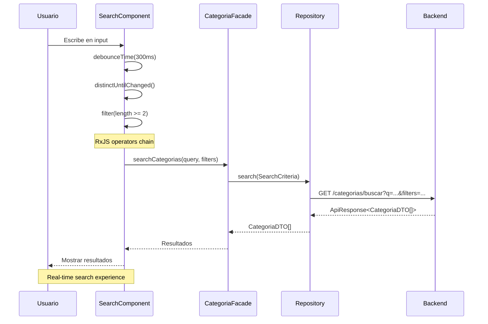
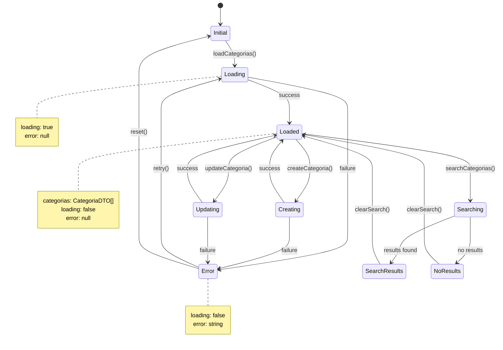
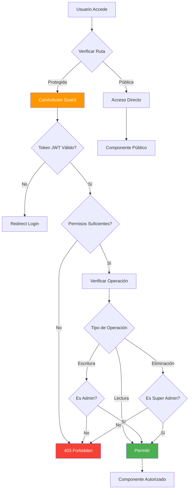
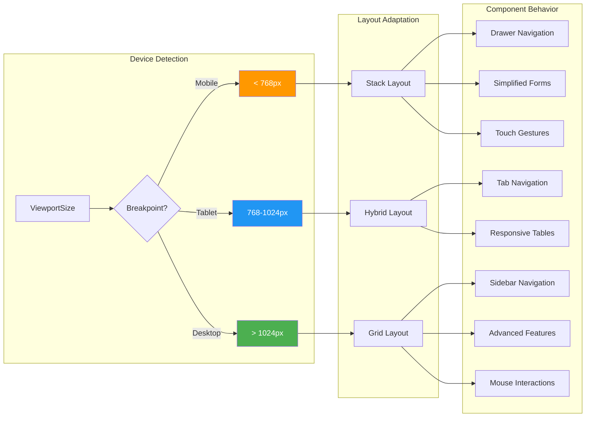
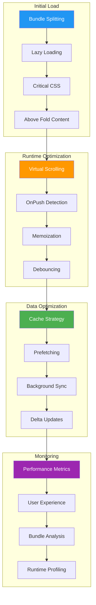

# 📈 Diagramas de Arquitectura y Flujos

## 🏗️ Diagrama de Arquitectura Actual vs Propuesta

### 📊 **Arquitectura Actual**



### 🚀 **Arquitectura Propuesta** 



---

## 🔄 Flujo de Datos: Lectura de Categorías

### 🌐 **Flujo Público (Sin Autenticación)**



### 🔒 **Flujo Administrativo (Con Autenticación)**

```mermaid
sequenceDiagram
    participant A as Admin
    participant M as ManagementContainer
    participant F as CategoriaFacade
    participant BS as BusinessService
    parameter VS as ValidationService
    participant AR as AdminRepository
    participant SS as StateService
    participant API as Backend API
    
    A->>M: Crear categoría
    M->>F: createCategoria(data)
    F->>VS: validateCreation(data)
    
    alt Validación OK
        VS-->>F: ValidationResult.valid
        F->>BS: processCreation(validData)
        BS->>AR: create(categoria)
        AR->>API: POST /api/segura/categorias/create
        API-->>AR: ApiResponse<CategoriaDTO>
        AR-->>BS: CategoriaDTO
        BS->>SS: addCategoria(categoria)
        SS-->>F: State updated
        F->>F: invalidateCache()
        F-->>M: CategoriaDTO created
        M-->>A: Success message
    else Validación Error
        VS-->>F: ValidationResult.errors
        F-->>M: ValidationErrors
        M-->>A: Error display
    end
```

---

## 🌳 Flujo de Jerarquía de Categorías

### 📊 **Construcción de Árbol Jerárquico**

```mermaid
graph TD
    A[Categorías Planas] --> B{Procesar Jerarquía}
    
    B --> C[Identificar Raíces]
    C --> D[categoriaPadreId === null]
    
    B --> E[Agrupar por Padre]
    E --> F[Map<parentId, children[]>]
    
    D --> G[Para cada raíz]
    G --> H[Buscar hijos recursivamente]
    H --> I[Construir subcategorias[]]
    I --> J[Árbol completo]
    
    F --> H
    
    J --> K[CategoriaTree Component]
    K --> L[Renderizado jerárquico]
    
    style A fill:#ffeb3b
    style J fill:#4caf50
    style L fill:#2196f3,color:#fff
```

### 🔍 **Flujo de Expansión Lazy Loading**



---

## 🔍 Flujo de Búsqueda Avanzada

### 📱 **Búsqueda con Debouncing y Filtros**



---

## 💾 Estrategia de Cache Multi-Nivel

### 🗂️ **Cache Hierarchy**

```mermaid
graph TB
    subgraph "Cache Levels"
        A[Component Level Cache] --> B[Service Level Cache]
        B --> C[HTTP Interceptor Cache]
        C --> D[Browser Cache]
    end
    
    subgraph "Cache Keys Strategy"
        E[Static Data: 'categorias-all']
        F[User-specific: 'user-{id}-favoritas']
        G[Search Results: 'search-{query}-{filters}']
        H[Hierarchy: 'hierarchy-{level}-{parentId}']
    end
    
    subgraph "Invalidation Strategy"
        I[Time-based TTL]
        J[Event-based Invalidation]
        K[Pattern-based Cleanup]
        L[Memory Pressure Cleanup]
    end
    
    A --> E
    B --> F
    C --> G
    D --> H
    
    E --> I
    F --> J
    G --> K
    H --> L
    
    style A fill:#2196f3,color:#fff
    style I fill:#ff9800,color:#fff
```

---

## 🔄 Estado de Aplicación con RxJS

### 📊 **State Flow Diagram**



---

## 🔐 Flujo de Autorización

### 🚦 **Permission-based Access Control**



---

## 📱 Responsive Design Flow

### 🖥️ **Multi-Device Experience**



---

## 🎯 Performance Optimization Flow

### ⚡ **Optimization Strategy**



---

**Próximo:** [Mejores Prácticas](./06-MEJORES-PRACTICAS.md)
