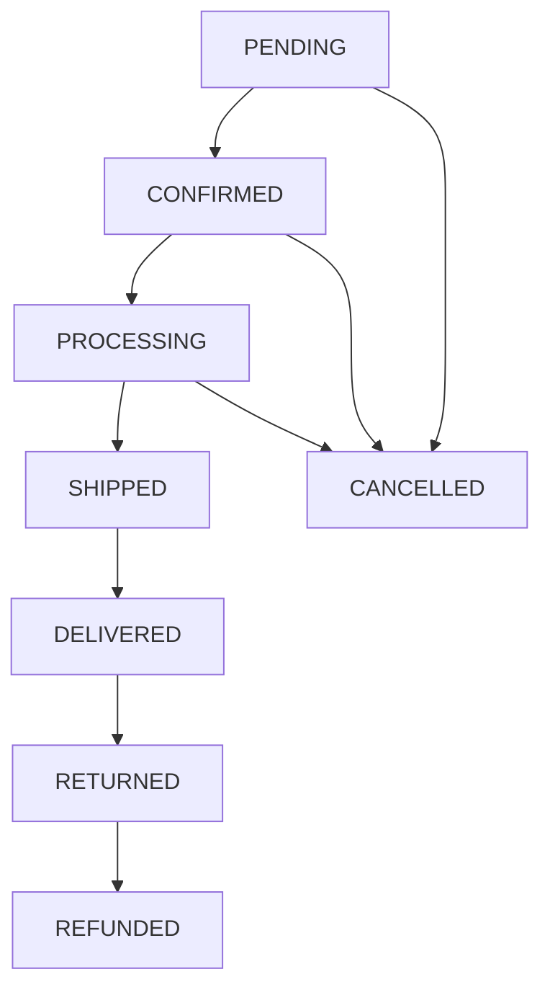

# 📦 Order Management - Gestión de Pedidos

## 📋 Descripción

Sistema completo de gestión de pedidos, desde la creación hasta la entrega y post-venta.

## 🎯 Componentes Principales

### 📋 Order Processing
- **Order Creation** - Creación de pedidos
- **Order Validation** - Validación de pedidos
- **Order Status** - Estados del pedido
- **Order Timeline** - Línea de tiempo del pedido
- **Order Modifications** - Modificaciones del pedido

### 📊 Order Tracking
- **Order Tracking** - Seguimiento de pedidos
- **Status Updates** - Actualizaciones de estado
- **Delivery Tracking** - Seguimiento de entrega
- **Notification System** - Sistema de notificaciones
- **Progress Indicators** - Indicadores de progreso

### 🏪 Fulfillment
- **Inventory Management** - Gestión de inventario
- **Warehouse Operations** - Operaciones de almacén
- **Picking & Packing** - Picking y empaque
- **Shipping Integration** - Integración con envíos
- **Quality Control** - Control de calidad

### 📞 Customer Service
- **Order Support** - Soporte de pedidos
- **Return Management** - Gestión de devoluciones
- **Refund Processing** - Procesamiento de reembolsos
- **Customer Communication** - Comunicación con clientes
- **Issue Resolution** - Resolución de problemas

### 📈 Order Analytics
- **Order Reports** - Reportes de pedidos
- **Performance Metrics** - Métricas de rendimiento
- **Customer Insights** - Insights de clientes
- **Revenue Analytics** - Analytics de ingresos
- **Trend Analysis** - Análisis de tendencias

## 📁 Estructura de Archivos

```
src/app/orders/
├── order-processing/
│   ├── order-creation/
│   ├── order-validation/
│   ├── order-status/
│   └── order-timeline/
├── order-tracking/
│   ├── tracking-component/
│   ├── status-updates/
│   ├── delivery-tracking/
│   └── progress-indicators/
├── fulfillment/
│   ├── inventory-check/
│   ├── warehouse-ops/
│   ├── picking-packing/
│   └── shipping-integration/
├── customer-service/
│   ├── order-support/
│   ├── returns/
│   ├── refunds/
│   └── communication/
├── analytics/
│   ├── order-reports/
│   ├── performance-metrics/
│   └── customer-insights/
└── shared/
    ├── order.service.ts
    ├── fulfillment.service.ts
    └── order.interfaces.ts
```

## 🚀 Estado Actual vs Objetivo

### ✅ Implementado
- [ ] Ningún componente implementado aún

### 🔄 En Desarrollo
- [ ] Estructura básica de pedidos

### 📋 Pendiente
- [ ] **Order Processing**
  - [ ] Order creation workflow
  - [ ] Status management
  - [ ] Validation system
  - [ ] Timeline tracking
- [ ] **Order Tracking**
  - [ ] Real-time tracking
  - [ ] Status notifications
  - [ ] Customer portal
- [ ] **Fulfillment System**
  - [ ] Inventory integration
  - [ ] Warehouse management
  - [ ] Shipping coordination
- [ ] **Customer Service**
  - [ ] Return system
  - [ ] Refund processing
  - [ ] Support tickets
- [ ] **Analytics & Reporting**
  - [ ] Order dashboards
  - [ ] Performance reports
  - [ ] Customer analytics

## 🔗 Dependencias

- **@angular/material** - UI components
- **ngx-charts** - Gráficos y analytics
- **socket.io-client** - Real-time updates
- **date-fns** - Manejo de fechas

## 📖 Guías

- [Order Flow Implementation](./order-flow.md)
- [Status Management](./status-management.md)
- [Tracking System](./tracking-system.md)
- [Returns & Refunds](./returns-refunds.md)
- [Analytics Setup](./analytics-setup.md)

## 🎯 Estados del Pedido

```typescript
enum OrderStatus {
  PENDING = 'pending',           // Pedido creado, pendiente pago
  CONFIRMED = 'confirmed',       // Pago confirmado
  PROCESSING = 'processing',     // En proceso de fulfillment
  SHIPPED = 'shipped',          // Enviado
  DELIVERED = 'delivered',      // Entregado
  CANCELLED = 'cancelled',      // Cancelado
  RETURNED = 'returned',        // Devuelto
  REFUNDED = 'refunded'         // Reembolsado
}
```

## 🔄 Flujo de Estados



## 🎯 Roadmap de Desarrollo

### Fase 1 - Básico
1. **Order Creation**
   - Basic order workflow
   - Status management
   - Customer notifications

2. **Order Tracking**
   - Simple tracking page
   - Status updates
   - Email notifications

### Fase 2 - Avanzado
1. **Fulfillment Integration**
   - Inventory management
   - Warehouse operations
   - Shipping integration

2. **Customer Service**
   - Return system
   - Refund processing
   - Support integration

### Fase 3 - Analytics
1. **Reporting System**
   - Order analytics
   - Performance metrics
   - Customer insights

2. **Optimization**
   - Predictive analytics
   - Process automation
   - AI recommendations

## 📊 KPIs Clave

- **Order Fulfillment Rate** - % de pedidos completados
- **Average Processing Time** - Tiempo promedio de procesamiento
- **Customer Satisfaction** - Satisfacción del cliente
- **Return Rate** - Tasa de devoluciones
- **Revenue per Order** - Ingresos por pedido
